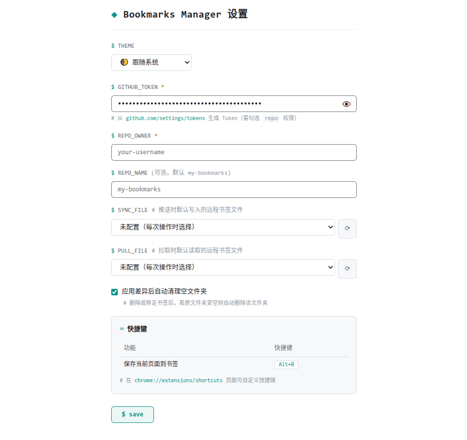

<p align="center">
  <br>
  
  <br>
  <h1 align="center">Bookmarks Sync</h1>
  <p align="center">
    以 GitHub 仓库为后端的浏览器书签管理器扩展
    <br />
    <strong>Chrome / Edge · Manifest V3 · TypeScript + React</strong>
  </p>
</p>

<p align="center">
  <a href="https://github.com/LeonidasLux/bookmarks-sync/blob/main/LICENSE">
    
  </a>
  <a href="https://github.com/LeonidasLux/bookmarks-sync">
    
  </a>
  <a href="https://chromewebstore.google.com/detail/bookmarks-sync/jpojpiagoljceiakjopfgphachnlciop">
    
  </a>
  
  
</p>

---

## 📖 概述

**Bookmarks Sync** 是一款 Chrome / Edge 浏览器扩展，将你的浏览器书签与 GitHub 仓库双向同步。书签数据以 `bookmarks-[name].json` 文件存储在 Git 仓库中（兼容旧版 `bookmarks.json`），**不同浏览器 / 设备可分别使用独立文件**，你可以：

- 在**多台电脑 / 多个浏览器**之间保持书签一致
- 通过 GitHub 的版本历史追溯书签变更
- 配合 CI/CD 或其他工具对书签数据进行二次处理

> **术语提醒**：本项目使用「书签」指代 Bookmark、「扩展」指代 Extension、「同步」指代双向 Sync 过程 —— 相关术语定义参见 [CONTEXT.md](./CONTEXT.md)。

---

## ✨ 功能

| 功能 | 说明 |
|------|------|
| 📂 **书签浏览** | 树形文件夹导航 + 面包屑路径，快速浏览所有书签 |
| 🗂 **多书签文件** | 远程支持多个 `bookmarks-[name].json`，不同浏览器各存各的书签 |
| 📥 **拉取同步** | 选择指定书签文件拉取，与本地差异对比后**选择性应用** |
| 📤 **推送同步** | 选择或**新建**书签文件，将本地书签强制推送到 GitHub |
| ⏰ **定时同步** | 设置固定间隔（分钟）自动推送本地书签到远程，可在设置中开关 |
| 🔍 **差异审核** | 拉取后按「新增/删除/修改」分组展示变更，可逐条勾选应用 |
| 🗑 **空文件夹清理** | 同步后自动删除变空的文件夹（可关闭） |
| ⚙️ **默认文件配置** | 推送 / 拉取默认文件可在设置中预设（远程下拉 + 新建） |
| 📌 **快捷保存** | 弹窗中一键将当前页面保存到书签 |
| 🤖 **智能目录推荐** | 保存书签时由 [TypeSafe Jev](https://docs.typesafe.ai/primitives/choice) 推荐目标目录并预选，保存前可手动改选（需在设置中配置 TypeSafe API Key） |

---

## 🖼️ 截图

<table>
  <tr>
    <td align="center"><strong>弹窗主页</strong></td>
    <td align="center"><strong>差异审核</strong></td>
    <td align="center"><strong>设置页面</strong></td>
  </tr>
  <tr>
    <td></td>
    <td></td>
    <td></td>
  </tr>
</table>

> ⚠️ 截图文件尚未生成，首次使用前请创建 `.github/screenshots/` 目录并放入截图。

---

## 🚀 快速开始

### 安装扩展

已上架 **Chrome 网上应用店**，推荐直接安装：

- [Chrome Web Store — Bookmarks Sync](https://chromewebstore.google.com/detail/bookmarks-sync/jpojpiagoljceiakjopfgphachnlciop)

如需使用最新开发版本，可通过开发者模式加载源码构建：

1. **构建扩展**
   ```bash
   git clone https://github.com/LeonidasLux/bookmarks-sync.git
   cd bookmarks-sync
   pnpm install
   pnpm build
   ```

2. **加载到浏览器**
   - Chrome: 地址栏访问 `chrome://extensions` → 开启「开发者模式」→「加载已解压的扩展程序」→ 选择 `dist/` 目录
   - Edge: 地址栏访问 `edge://extensions` → 开启「开发者模式」→「加载解压缩的扩展」→ 选择 `dist/` 目录

3. **配置 GitHub 连接**（见下文）

### 前置条件

- [Node.js](https://nodejs.org/) >= 18
- [pnpm](https://pnpm.io/) >= 11.2
- 一个 GitHub 仓库用于存储书签数据
- [GitHub Personal Access Token](https://github.com/settings/tokens)（需要 `repo` 权限）

---

## ⚙️ 配置指南

### GitHub Token 准备

1. 访问 [GitHub Settings → Tokens](https://github.com/settings/tokens)
2. 点击 **Generate new token (classic)**
3. 勾选 `repo` 权限范围（Full control of private repositories）
4. 生成并复制 Token（例如 `ghp_xxxxxxxxxxxxxxxxxxxx`）

> ⚠️ **安全提示**：Token 仅存储在浏览器本地 `chrome.storage.local` 中，不会上传到其他任何第三方服务。

### 扩展配置

右键扩展图标 →「选项」或点击弹窗中的 ⚙，填写：

| 配置项 | 说明 | 示例 |
|--------|------|------|
| **GitHub Token** | 个人访问令牌 | `ghp_xxxxxxxxxx` |
| **仓库 Owner** | 仓库所属用户/组织 | `LeonidasLux` |
| **仓库名称** | 存储书签的仓库名 | `bookmarks-sync` |
| **同步默认文件** | 推送时默认写入的远程书签文件（可下拉选择远程文件或新建） | `bookmarks-chrome.json` |
| **拉取默认文件** | 拉取时默认读取的远程书签文件 | `bookmarks-chrome.json` |
| **自动清理空文件夹** | 应用差异后删除变空的文件夹 | 开/关 |
| **TypeSafe API Key** | 可选；配置后保存书签时用 Jev 推荐目标目录 | `ts_xxxxxxxxxx` |

> **文件命名规则**：远程书签文件统一为 `bookmarks-[name].json`，`name` 仅限英文（字母开头，可含数字 / 中划线 / 下划线，最长 50 字符）。旧版 `bookmarks.json` 仍受支持，可在文件列表中正常选择。

> **智能目录推荐**：打开「保存书签」面板时，扩展会把当前页面标题 / 链接与本地书签目录（含目录内书签样本、子目录名）提交给 Jev，由模型在**全部目录**上选出最合适的目录并预选——目录不超过 255 个时一次 Choice 覆盖全部候选，超过上限时等分分块并行提问（同一请求内的多个问题），任何目录都不会被提前淘汰。建议行下方会按置信度由高到低列出前 5 个备选目录（来自模型返回的概率分布），点击即可改选；下方「手动选择」区以树形展示完整目录层级，支持展开 / 折叠全部与按名称 / 路径搜索（搜索会自动展开命中目录的祖先链）。Key 未配置或调用失败时自动退回原有的手动选择流程。

---

## 🎯 使用方法

### 基本操作

| 操作 | 方式 |
|------|------|
| 打开弹窗 | 点击浏览器工具栏的扩展图标 |
| 浏览书签 | 目录以树形展示（默认折叠），点击箭头展开 / 折叠查看层级，点击目录进入，面包屑导航返回 |
| 保存当前页 | 点击弹窗工具栏的 `➕` 按钮 |
| 打开设置 | 点击弹窗工具栏的 `⚙` 按钮 |

### 同步工作流

**推送（本地 → GitHub）：**
1. 在弹窗中点击 `↑` 按钮，弹出「选择同步文件」
2. 从远程文件列表中选择目标文件，或选择「新建文件」输入英文名（自动生成 `bookmarks-[name].json`）；默认文件会自动预选
3. 预览推送内容并确认
4. 强制覆盖所选文件，并生成一次 Git 提交（文件不存在时自动新建）

**拉取（GitHub → 本地）：**
1. 在弹窗中点击 `↓` 按钮，弹出「选择拉取文件」
2. 从远程文件列表中选择要拉取的书签文件（默认文件自动预选）
3. 扩展对比该文件与本地书签，生成差异列表
4. 在差异审核界面逐项勾选要应用的变更
5. 点击「应用选中」写入浏览器原生书签

> 💡 **同步策略**：推送为**强制覆盖**（远程已有变更将被丢弃）；拉取为差异对比后**选择性应用**。默认文件可在设置中预先配置，未配置时每次操作弹窗中选择。

> ⚠️ **未配置时**：GitHub Token、仓库 Owner / 名称任一为空时，弹窗仍可正常浏览书签、查看统计与保存当前标签页；工具栏的推送 `↑` / 拉取 `↓` 按钮会置灰禁用，并在顶部显示「请先配置 GitHub 仓库连接」提示条，点击 `$ cd setup` 直达设置页。

---

## 🏗️ 项目架构

```
bookmarks-sync/
├── src/
│   ├── extension/
│   │   ├── popup/                     # 弹窗 UI（React）
│   │   │   ├── App.tsx                # 根组件：编排 hooks 和子组件（~316 行）
│   │   │   ├── constants.ts           # 常量：文件夹 ID、差异标签/颜色
│   │   │   ├── styles.ts              # 内联样式对象（含弹窗/模态框样式）
│   │   │   ├── theme.tsx              # ThemeProvider + useTheme
│   │   │   ├── index.html
│   │   │   ├── main.tsx               # ReactDOM 入口
│   │   │   ├── hooks/                 # 状态逻辑层
│   │   │   │   ├── useConfig.ts       #   配置加载 + 同步状态
│   │   │   │   ├── useBookmarkNavigation.ts  #   文件夹导航 + 面包屑
│   │   │   │   ├── useBookmarkStats.ts       #   书签统计
│   │   │   │   ├── useBookmarkVisitCounts.ts #   访问次数获取
│   │   │   │   ├── useFolderPicker.ts        #   保存目标文件夹选择
│   │   │   │   ├── useFolderTree.ts          #   目录树构建 + 展开 / 折叠状态
│   │   │   │   ├── useSync.ts         #   推送/拉取同步操作（含远程文件列表）
│   │   │   │   └── useDiffReview.ts   #   差异审核状态管理
│   │   │   └── components/            # 展示组件层
│   │   │       ├── Toolbar.tsx         #   顶部工具栏
│   │   │       ├── BreadcrumbNav.tsx   #   面包屑导航
│   │   │       ├── BookmarkList.tsx    #   书签列表 + 目录树
│   │   │       ├── BookmarkStats.tsx   #   书签统计展示
│   │   │       ├── DiffReviewPanel.tsx #   差异审核面板
│   │   │       ├── FilePickModal.tsx   #   推送/拉取文件选择弹窗（含新建）
│   │   │       ├── PushConfirmModal.tsx#   推送预览确认弹窗
│   │   │       ├── FolderPicker.tsx    #   保存书签目标文件夹选择
│   │   │       ├── FolderTree.tsx      #   目录树：层级缩进 + 展开 / 折叠
│   │   │       ├── LoadingView.tsx     #   加载状态
│   │   │       └── UnconfiguredView.tsx #  未配置提示
│   │   ├── options/                   # 设置页面（React，双列排布）
│   │   │   ├── App.tsx                # 页面装配：标题栏 + 双列 + 保存栏
│   │   │   ├── palette.ts             # 暗色/亮色调色板
│   │   │   ├── styles.ts              # 字体 / 输入框 / 聚焦高亮等共享样式
│   │   │   ├── types.ts               # 设置页共享类型（UpdateField）
│   │   │   ├── index.html
│   │   │   ├── main.tsx
│   │   │   ├── hooks/
│   │   │   │   ├── useConfigForm.ts   #   表单状态管理
│   │   │   │   ├── useCommands.ts     #   快捷键列表
│   │   │   │   ├── useRemoteFiles.ts  #   远程书签文件列表拉取
│   │   │   │   └── useTheme.ts        #   主题解析 + body 主题同步
│   │   │   └── components/
│   │   │       ├── SettingsColumns.tsx #  双列布局容器（窄屏回落单列）
│   │   │       ├── SectionCard.tsx     #  设置区块卡片
│   │   │       ├── FieldLabel.tsx      #  字段标签
│   │   │       ├── TextInput.tsx       #  文本/数字输入框
│   │   │       ├── SecretInput.tsx     #  密钥输入框（可显隐）
│   │   │       ├── ThemeSelector.tsx   #  主题选择器
│   │   │       ├── GithubSection.tsx   #  左列：仓库连接
│   │   │       ├── SyncFilesSection.tsx#  左列：同步文件（推送 + 拉取）
│   │   │       ├── SuggestSection.tsx  #  右列：TypeSafe 智能推荐
│   │   │       ├── SyncOptionsSection.tsx # 右列：同步行为
│   │   │       ├── AutoSyncSection.tsx #  右列：定时同步
│   │   │       ├── ShortcutsSection.tsx#  右列：快捷键
│   │   │       ├── SaveBar.tsx         #  底部保存栏
│   │   │       └── FileDefaultPicker.tsx # 默认文件下拉 + 新建（英文名校验）
│   │   └── background/                # Service Worker
│   │       ├── service-worker.ts      #   消息路由 + 初始化（~190 行）
│   │       ├── bookmark-utils.ts      #   书签树遍历 / 文件夹路径解析
│   │       ├── folder-utils.ts        #   空文件夹检测与递归清理
│   │       └── diff-applier.ts        #   将差异应用到浏览器原生书签
│   ├── shared/                        # 共享层
│   │   ├── types.ts                   #   类型定义（Bookmark, AppConfig 等）
│   │   └── sync.ts                    #   SyncEngine（GitHub REST API 客户端，多文件支持）
│   └── __tests__/                     # 测试（32 文件 / 214 用例）
│       ├── shared/                    #   sync（多文件/列表/校验）+ types
│       ├── background/                #   bookmark-utils + diff-applier + folder-utils
│       ├── popup/hooks/               #   useBookmarkStats + useSync + useDiffReview + useFolderPicker
│       ├── popup/components/          #   Toolbar + BreadcrumbNav + BookmarkList + BookmarkStats
│       │                               #   + DiffReviewPanel + FilePickModal + FolderPicker
│       │                               #   + PushConfirmModal + StatusViews
│       ├── options/hooks/             #   useConfigForm + useCommands + useRemoteFiles + useTheme
│       ├── options/components/        #   FormControls + SettingsColumns + GithubSection
│       │                               #   + SyncFilesSection + SettingsCards
│       └── options/                   #   App 装配（标题栏 / 双列 / 保存）
├── vite.config.ts                     # Vite + CRX 打包配置
├── vitest.config.ts                   # Vitest 测试配置
├── tsconfig.json
├── package.json
└── pnpm-workspace.yaml
```

### 核心模块

| 模块 | 角色 | 职责 |
|------|------|------|
| **Popup** | 用户界面 | 书签浏览、文件夹导航、一键保存、文件选择、同步触发、差异审核 |
| **Options** | 配置管理 | 双列布局：左列 GitHub 连接与推送/拉取默认文件（远程下拉 + 新建），右列智能推荐、同步行为、定时同步与快捷键 |
| **Service Worker** | 后台引擎 | 消息路由、浏览器书签读写、GitHub API 调用、差异计算与应用 |
| **Hooks** | 状态逻辑 | 独立 hooks 管理导航/同步/审核/配置，与 UI 组件解耦 |
| **Tools** | 公共服务 | 书签树遍历、文件夹路径解析、空文件夹检测与递归清理 |
| **Sync Engine** | 同步核心 | GitHub REST API（多书签文件、base64 编解码、文件 SHA 管理）、差异计算算法 |

### 数据流

```
┌─────────────┐     chrome.runtime.sendMessage     ┌───────────────────┐
│  Popup UI   │ ──────────────────────────────────→ │  Service Worker   │
│  (React)    │ ←────────────────────────────────── │  (background)     │
└─────────────┘     response callback               └────────┬──────────┘
                                                              │
                                                   ┌──────────▼──────────┐
                                                   │   GitHub REST API   │
                                                   │ /repos/{owner}/{repo}/contents/bookmarks-[name].json  │
                                                   └─────────────────────┘
```

### 数据流

```

---

## 🛠️ 开发指南

### 环境准备

```bash
pnpm install
```

### 开发服务器

```bash
pnpm dev
```

### 本地开发配置（.env）

`pnpm dev` 时可通过项目根目录的 `.env` 文件注入固定的扩展配置（如 GitHub Token），避免每次手动填写：

```bash
cp .env.example .env
```

然后按需填写 `VITE_GITHUB_TOKEN`、`VITE_REPO_OWNER`、`VITE_REPO_NAME` 等变量（完整列表见 `.env.example`）。

这些值**仅本地开发（`pnpm dev`）生效**，优先级高于已保存的扩展配置，方便调试；不会被写入正式构建产物，`.env` 已被 `.gitignore` 忽略。

本地调试智能目录推荐时，可直接复用 shell 中已导出的 TypeSafe Key（无需写进 `.env`）：

```bash
# ~/.zshrc
export TYPESAFE_API_KEY=ts_xxxxxxxxxx

pnpm dev   # development 模式下自动注入为 VITE_TYPESAFE_API_KEY
```

`TYPESAFE_API_KEY` 仅在 `development` 模式注入，测试与正式构建都不会带上该值（可用 `grep -r "$TYPESAFE_API_KEY" dist/` 自检）。

### 构建

```bash
pnpm build
```

编译 TypeScript 并输出到 `dist/` 目录，产物为可直接加载的扩展包。

### 测试

```bash
pnpm test        # 单次运行全部测试
pnpm test:watch  # watch 模式
```

基于 [Vitest](https://vitest.dev/) + [Testing Library](https://testing-library.com/)，当前 **21 个测试文件 / 145 个用例**，覆盖：
- 共享层：`SyncEngine` 多文件推送/拉取/列表（含空仓库 404 处理）、文件名校验、`computeDiff` 差异算法、`normalizeFolderPath` 路径规范化
- Hooks：差异审核状态流转、同步操作（携带 fileName）、配置表单读写、远程文件列表
- 组件：文件选择弹窗（默认预选 / 新建校验）、默认文件下拉（未推送标记）、推送确认、工具栏、面包屑导航、差异审核面板
- 后台工具：书签树遍历展平、空文件夹检测与递归清理

### 预览构建产物

```bash
pnpm preview
```

### 提交规范

- Commit 使用中文描述变更（如 `feat(sync): 书签同步后自动清理空文件夹`）
- 遵循常规提交范围：`feat`、`fix`、`chore`、`refactor` 等

### 编码约定

- 独立功能拆分单独的 hooks 文件实现
- 合理拆分组件，避免全部 UI 写在一个文件里
- 每个功能都需要有对应的测试用例覆盖
- 使用 `pnpm build && pnpm test` 确保编译和测试通过

---

## 🔧 技术栈

| 技术 | 用途 |
|------|------|
| [TypeScript](https://www.typescriptlang.org/) | 类型安全 |
| [React 18](https://react.dev/) | UI 框架 |
| [Vite 5](https://vitejs.dev/) | 构建工具 |
| [crxjs](https://crxjs.dev/) | Chrome 扩展 Vite 插件 |
| [Chrome Extension API (Manifest V3)](https://developer.chrome.com/docs/extensions/) | 浏览器扩展能力 |
| [pnpm](https://pnpm.io/) | 包管理器 |

---

## 📄 许可

本项目基于 [MIT License](./LICENSE) 开源。

版权所有 © 2026 [LeonidasLux](https://github.com/LeonidasLux)

---

<p align="center">
  Built with ❤️ by <a href="https://github.com/LeonidasLux">LeonidasLux</a>
</p>
